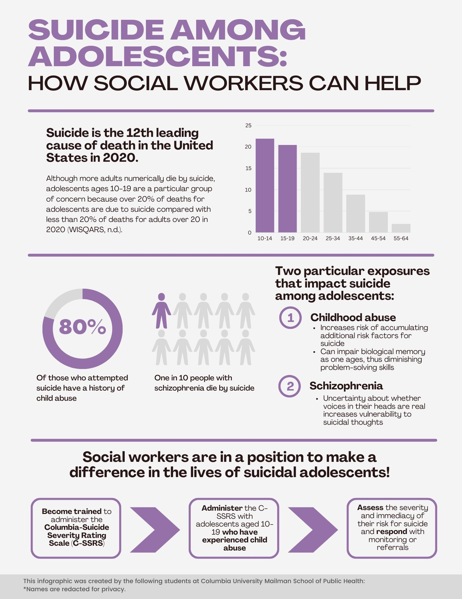

This page contains descriptions of quantitative, writing, and leadership skills I mostly gained before pursuing my MPH.

## Quantitative skills and projects

While working as a Research Associate II at Centerstone’s Research Institute, I developed my skills in quantitative data analysis in SPSS. I worked on data analysis projects for two different grants that involved reporting descriptive statistics and performing Chi-square tests, independent samples t-tests, and paired samples t-tests. These tasks further involved preparing the dataset by assigning value labels, identifying missing values, and selecting the variable type.

Some projects I have contributed data analysis to include a survey about LGBTQ+ youth’s most recent healthcare experiences and a comparison of demographics and indicators of quality of life among clients with opioid use disorder who have attempted suicide within the previous month versus participants who have not attempted suicide.

## Analytical writing skills

As an undergraduate student at New York University, I often wrote various forms of analytical essays. My final paper for Black Life and Medicine was a primary source analysis of a section from “Our Bodies, Our Voices: The State of Black Women & Reproductive Justice” that examines impacts of policies on the health of black women. Additionally, my final paper for Source of a Nation: From Obama to Trump was a historical and comparative analysis about how Donald Trump’s values are not new but rather are extensions of the colonization and discrimination the country was founded on.

Furthermore, while working as an Assistant Research Scientist at the Institute of Human Development and Social Change, I co-wrote a memo to the New York City Department of Education to advise their trauma-informed approach to schooling during the COVID-19 pandemic based on recommendations from how schools handled education during and after previous crises.

## Leadership skills

I co-founded and served as President of Cruelty-Free Northeastern during my freshman and sophomore years of college, and I was elected Treasurer of the International Rescue Committee at New York University (NYU) during my senior year of college. Furthermore, I served as the Presentation Manager and Twitter Co-Manager during my internship at the SEED Program at NYU Langone Health.

## Visualization

I am passionate about effective communication of research and evaluation findings and have attended trainings about best practices in data visualization from Ann Emery. A sample data visualization I created for a class project is below.

